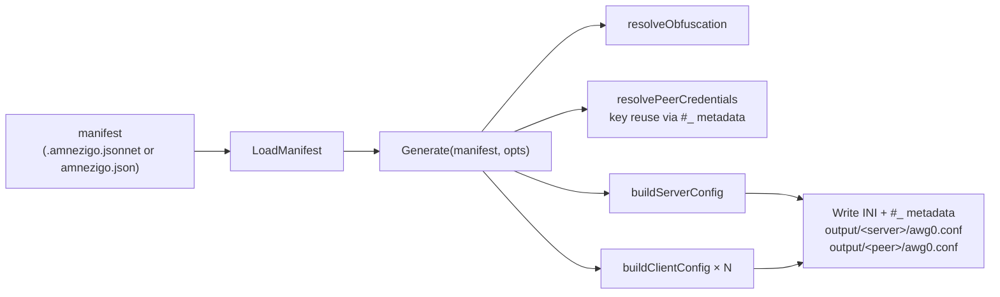

# Repository Guidelines

Agent guidelines for **amnezigo** — a CLI tool and Go library that generates
AmneziaWG v2.0 configurations from a declarative manifest. Module:
`github.com/Arsolitt/amnezigo`, Go 1.26.1, GPL-3.0.

> The repo completed a **declarative refactor** (plan phase P2): the legacy
> imperative CLI (`init`/`add`/`edit`/`list`/`export`/`remove`) and the
> `Manager` API were **removed entirely** (commit `226e4b8`). Only `generate`,
> `validate`, and `analyze` remain. Any reference to the old commands or
> `Manager` describes deleted code.

## Project Overview

amnezigo is a **config generator** (not a daemon). It reads a single manifest
(`amnezigo.json` or `.amnezigo.jsonnet`) describing the full network topology,
resolves AWG obfuscation parameters and X25519 crypto, then emits ready-to-deploy
`awg0.conf` files — one per server, one per client peer. Output is INI with `#_`
metadata comments that let later runs **reuse peer credentials** across regenerations.

It also doubles as an importable Go library: every business-logic function lives
in the root package `amnezigo` and is callable without the CLI.

## Architecture & Data Flow

All business logic lives as `.go` files at the **repo root** in package `amnezigo`
(no `internal/` for logic). The CLI is a thin cobra layer that calls into it.

The core flow is **manifest → generate → configs**:



1. **`LoadManifest`** (`loader.go:26`) — discovers the manifest. `.amnezigo.jsonnet`
   **takes precedence** over `amnezigo.json`; Jsonnet is evaluated to JSON then
   parsed. Version field MUST equal `1` (`currentManifestVersion`).
2. **`Generate`** (`pipeline.go:423`) — the orchestrator. Two-pass: compute all
   configs in memory, then write. Ordered steps:
   - `resolveObfuscation` (`pipeline.go:39`) — nil pointer fields in the manifest
     signal "generate randomly"; fills S/H/J defaults.
   - `LoadCredentials` + `resolvePeerCredentials` (`pipeline.go:164`) — reuse
     persisted keys unless `--full-reset`; client keys recovered from each peer's
     own client config and the server's `#_PrivateKey` metadata.
   - `buildServerConfig` / `buildClientConfig` — build INI structs.
   - Write each as `FileOutput{RelPath, Content}`. Server at `<serverName>/awg0.conf`,
     each client at `<peerName>/awg0.conf`.
3. **`WriteServerConfig` / `WriteClientConfig`** (`writer.go`) — INI serialization
   with `#_`-prefixed metadata lines.

Key supporting modules:

- `generator.go` — random obfuscation params (S-prefixes, junk, header ranges).
- `cps.go` — CPS (Custom Packet String) grammar and I-packet generation.
- `protocols.go` + `quic.go`/`dns.go`/`dtls.go`/`stun.go`/`sip.go` — protocol
  templates that mimic real wire formats; `getTemplate` dispatches by name.
- `validation.go` — AWG 2.0 size-classification invariants and config findings.
- `analysis.go` — `Analyze()` heuristic report (RISK001–009).
- `keys.go` — X25519 keypair + PSK generation with WireGuard clamping.
- `parser.go` — INI + `#_` metadata parser (server configs only).

## Key Directories

```
cmd/amnezigo/main.go   # Entry point: func main() { cli.Execute() }
internal/cli/          # Cobra commands: generate.go, validate.go, analyze.go, cli.go
*.go                   # All business logic (root package `amnezigo`)
testdata/loader/       # Manifest fixtures (valid/, precedence/, invalid-*, …)
docs/                  # llms-full.txt is the source of truth; other guides are STALE (see below)
docs/plans/            # P0–P3 roadmap plans (PR blueprints)
```

## Development Commands

No Makefile. Use the Go toolchain directly:

```bash
# Build (output gitignored under build/)
go build -o build/amnezigo ./cmd/amnezigo/

# Install
go install github.com/Arsolitt/amnezigo/cmd/amnezigo@latest

# Tests
go test ./...                       # all
go test -run TestFunctionName .     # single root-package test (note: `.` not ./internal/...)
go test -cover ./...                # coverage summary
go test ./... -race                 # pre-merge gate

# Lint (run --fix first to auto-resolve, then fix the rest)
gofmt -l .                          # must be empty
go vet ./...
golangci-lint run --fix && golangci-lint run

# Docker (multi-stage: golang:1.26-alpine → amneziavpn/amneziawg-go:0.2.16)
docker build -t amnezigo .
```

Production binaries use `CGO_ENABLED=0 GOOS=linux go build -ldflags="-s -w"`
(see `Dockerfile`). Pre-merge quality bar: green tests + `go vet` clean +
`gofmt -l .` empty + `golangci-lint run` zero errors + `go test ./... -race`.

## Code Conventions & Common Patterns

### Package layout
- Root package `amnezigo` holds **all** business logic; `internal/cli` is a thin
  cobra wrapper; `cmd/amnezigo` is a one-line entry point. Tests are co-located
  with implementation (`*_test.go` in package `amnezigo`, white-box).

### Imports
stdlib, then external, then internal — blank line between groups:
```go
import (
    "fmt"
    "os"

    "github.com/spf13/cobra"

    "github.com/Arsolitt/amnezigo"
)
```
`goimports` local prefix is `github.com/Arsolitt/amnezigo`.

### Error handling
- Wrap with context: `fmt.Errorf("loading manifest: %w", err)`.
- Generator retry loops panic on exhaustion (fail-fast, e.g. `sMaxAttempts`).
- `tryDerivePublicKey` recovers a panic → returns `""` so the pipeline regenerates.
- CLI commands use `RunE` and return wrapped errors (except `validate`, which
  calls `os.Exit(1)` directly via the `exitFn` override seam).

### Crypto & randomness
- **`crypto/rand` everywhere in production** (via `math/big`). `math/rand` is
  **forbidden** in non-test files by the linter — use `math/rand/v2` if needed.
- WireGuard key clamping: `priv[0] &= 248; priv[31] &= 127; priv[31] |= 64`.
- Keys base64 (`StdEncoding`, 44 chars); `GenerateKeyPair`/`DerivePublicKey`/
  `GeneratePSK` panic only on unrecoverable system failures.

### Determinism
- Peer iteration is **sorted** (`sort.Strings`) in `Generate`, `buildServerConfig`,
  and `PeerNames()`. Never rely on Go map iteration order.

### Config format: INI + `#_` metadata
- Standard INI keys (`[Interface]` / `[Peer]`, `key = value`).
- Lines prefixed `#_` are **persisted metadata** (parsed back); bare `#` are
  ignored comments. Example: `#_PrivateKey`, `#_EndpointV4`, `#_Name`, `#_GenKeyTime`.
- `HeaderRange` serialized as `min-max` (uint32).

### Atomicity & I/O
- `SaveServerConfig` (`writer.go:139`) writes atomically: `.tmp` + `os.Rename`.
- **`Generate` writes via plain `os.WriteFile` (`0600`), NOT the atomic helper** —
  a mid-run failure can leave partial output. (There is no `SaveClientConfig` or
  `ParseClientConfig`; client configs are read only by the lightweight
  `extractClientCredentials` scanner for key recovery.)

### Pointer-nil semantics in the manifest
`ObfuscationManifest` uses `*int` / `*HeaderRange` to distinguish "set to 0"
from "unset" — `nil` drives the random-fallback in `resolveObfuscation`.

### CPS tag grammar (`cps.go`)
Supported tags (the legacy `<c>` counter tag is **deliberately removed** — it is
kernel-module-only and breaks `amneziawg-go` + all AmneziaVPN clients):

| Tag | Meaning | Length |
|-----|---------|--------|
| `<b 0xNN>` | literal bytes (hex) | `len(NN)/2` |
| `<r N>` | N random bytes | N |
| `<rc N>` | N chars from `[a-zA-Z]` (52-char alphabet) | N |
| `<rd N>` | N random digits | N |
| `<t>` | timestamp (uint32 BE) | 4 |
| `<d>` | data passthrough (AWG 2.0 userspace) | 0 |

### CLI conventions
- `spf13/cobra` v1.8.0. Commands built via `New*Command()` factories — **no
  `init()`**; flag setup lives inside each factory.
- Flag names are kebab-case (`--full-reset`, `--dry-run`, `--jpath`).
- `generate`/`analyze` bind closure-local vars; `validate` binds package-level
  vars (not re-entrant). Prefer the closure style for new commands.
- All user output goes through `cmd.OutOrStdout()` so tests inject a buffer.

## Important Files

| File | Role |
|------|------|
| `cmd/amnezigo/main.go` | Entry point → `cli.Execute()` |
| `internal/cli/cli.go` | Root command + `Execute()`; registers the 3 subcommands |
| `internal/cli/generate.go` | `generate` — manifest → configs pipeline driver |
| `internal/cli/validate.go` | `validate <config>` — lint a server config against AWG 2.0 invariants |
| `internal/cli/analyze.go` | `analyze` — RISK001–009 heuristics + size profiles |
| `manifest.go` | User-facing manifest schema (`Manifest`, `PeerManifest`, `ObfuscationManifest`) |
| `loader.go` | Manifest discovery + Jsonnet/JSON precedence + version validation |
| `pipeline.go` | `Generate()` orchestrator — the heart of the system |
| `credentials.go` | Peer key reuse across runs |
| `generator.go` | Random obfuscation generation |
| `cps.go` | CPS grammar + I-packet generation |
| `protocols.go` + `quic/dns/dtls/stun/sip.go` | Protocol templates + `getTemplate` dispatch |
| `validation.go` | `ValidatePacketSizes`, `ValidateHeaderRange`, `ValidateServerConfig` |
| `analysis.go` | `Analyze()` report + RISK heuristics |
| `keys.go` | X25519 keypair + PSK |
| `parser.go` / `writer.go` | INI + `#_` metadata parse/serialize |
| `presets.go` | Named obfuscation bundles (`lan-conservative`, `home-balanced`, `mobile-aggressive`, `test-minimal`) |
| `testdata/loader/valid/amnezigo.json` | Canonical reference manifest |
| `docs/llms-full.txt` | **Source-of-truth** AI-friendly doc (current architecture) |

## Runtime / Tooling Preferences

- **Go 1.26.1** (pinned in `go.mod`; `installation.md` confirms Go 1.26+ required).
- Direct deps: `github.com/google/go-jsonnet` v0.22.0, `github.com/spf13/cobra`
  v1.8.0, `golang.org/x/crypto` v0.45.0 (curve25519). No test-only deps beyond stdlib.
- **Linter**: `golangci-lint` v2.6.2 with a strict "golden config" (~70 linters).
  Notable: `depguard` forbids `math/rand` (non-test), `log` outside main (use
  `log/slog`); `mnd` flags magic numbers; `golines` enforces **120-char** max line
  length; `goimports` local prefix `github.com/Arsolitt/amnezigo`.
- No Makefile; all commands are plain `go` / `golangci-lint` / `docker`.
- `.gitignore` excludes `bin`, `build`, `*.conf`, `*.config`.

## Testing & QA

- **Stdlib `testing` only — no testify.** Assertions are manual
  `if got != want { t.Errorf(...) }`; `t.Fatalf` for setup failures.
- **Two-step error contract** in failure tests: assert `err != nil`, then
  `strings.Contains(err.Error(), expectedSubstring)`. **Error substrings are part
  of the public contract** — editing a message in `loader.go`/`validation.go`
  silently breaks tests.
- **Naming**: `TestFunctionName` for unit tests; `TestFunctionName_Scenario` for
  variants. Table-driven (`t.Run`) for fan-out (protocols, presets, MTU, boundary
  values); one-test-per-case for targeted regressions.
- **Fixtures**: real files under `testdata/loader/<sub>/` accessed via
  `filepath.Join("testdata", "loader", ...)`. **Tests are path-relative and only
  pass when `go test ./...` runs from the repo root** (where `package amnezigo`
  lives).
- **No `t.Parallel()`** in root tests (the `tparallel` linter is on but
  `paralleltest` is off). Adding it is allowed but unprecedented.
- In-memory I/O via `strings.NewReader` / `bytes.Buffer`; filesystem via
  `t.TempDir()`. No golden-file pattern.
- Randomness in tests relies on statistical variety over many iterations (e.g.
  `TestGenerateKeyPairUniqueness` loops 100×), not seeded RNG. The `analyze --seed`
  flag seeds an injected `io.Reader` (`math/rand/v2` PCG) only inside the CLI.
- All test helpers call `t.Helper()`.

### Reference manifest
`testdata/loader/valid/amnezigo.json` is the canonical manifest all loader/
generator tests build on: `version=1`, `network.mtu=1280`, obfuscation
(`protocol:"quic"`, `s1:30`/`s2:35`/`s3:20`/`s4:12`, full H1–H4, `jc:5`/
`jmin:250`/`jmax:750`), 2 peers (`server` + `phone`).

## Adding a New Protocol Template

Every new protocol template MUST satisfy this contract. Reviewers reject PRs that
miss any item. (sip.go + sip_test.go is the reference implementation.)

**Required**
- File `<protocol>.go` at the repo root with constructor `XxxTemplate() I1I5Template`
  (pure data, no I/O/globals).
- Co-located `<protocol>_test.go`.
- A `case` in `protocols.go:getTemplate` switch, append the constructor to the
  random-fallback slice, a row in `TestGetTemplate_NamedProtocols`
  (`protocols_test.go`), and the `--protocol` flag helptext in `internal/cli/analyze.go`.

**Tag rules**
- No `<c>` tag (removed in P0.1). For pseudo-monotonic bytes use `<rd N>` / `<r N>`.
- `<t>` is 4 bytes; at most one `<t>` per interval. `<rc>` is `[a-zA-Z]` only.

**Byte budget**
- Each interval ≥ 16 B (avoid raw-WG size collisions) and ≤ `MTU - 49 - 149 - S1`.
- Recommended ceiling ≤ 700 B per interval; `I5` always empty; `I1 ≥ I2 ≥ I3 ≥ I4`.
- Leading bytes must not collide with any prefix in the `existingTemplatePrefixes`
  slice in `protocols_test.go` — new fixed prefixes MUST be appended there in the
  same PR.

**Required per-template tests**
`TestXxxTemplate_AllIntervalsNonEmpty_I1ToI4`, `_I5Empty`, `_NoForbiddenTags`,
`_NoCounterLiteral`, `_FitsMTU`, `_ByteBudgetUnderCeiling`,
`_AtMostOneTimestampPerInterval`, `_AvoidsExistingPrefixes` (calls
`assertTemplateAvoidsExistingPrefixes`).

## Gotchas

- **`generate` is not atomic on disk** — it writes via `os.WriteFile`, not
  `SaveServerConfig`. A mid-run crash can leave a partial `output/` tree.
- **Per-client I1–I5 are not stored in the server config** — they live only in
  each client's own `awg0.conf`. CPS strings are regenerated every run; only
  crypto keys are reused.
- **Each client's PrivateKey is stored as `#_PrivateKey` in the server config's
  `[Peer]`** — this is the key-reuse recovery source, alongside the client config.
- **Docs split**: `docs/llms-full.txt` is current. The standalone guides
  (`installation.md`, `cli-reference.md`, `configuration.md`, `library-usage.md`,
  `obfuscation.md`) document the **removed** imperative CLI and are stale.
- **`validate` always parses with `Strict:true`** regardless of `--strict`;
  `--strict` only affects the exit code (warnings → exit 1). `--quiet` is
  text/summary-only (ignored in JSON mode).
- **`analyze` always exits 0** — findings are informational.
- Default protocol is `quic`; default MTU is `1280` when unset in the manifest.
