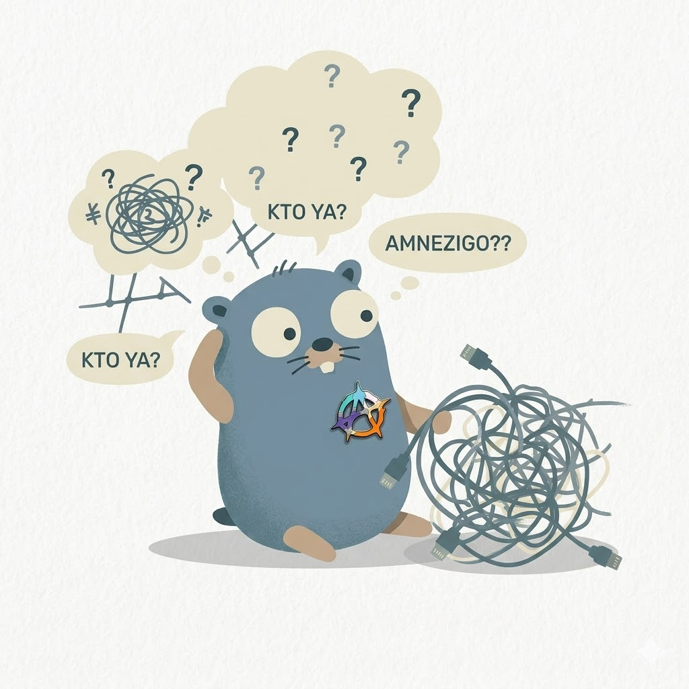

<p align="center">
  
</p>

<h1 align="center">Amnezigo</h1>

<p align="center">
  <strong>Amnezia</strong> + <strong>Go</strong> = <strong>Amnezigo</strong><br>
  A CLI tool and Go library for generating <a href="https://github.com/amnezia-vpn/amneziawg">AmneziaWG</a> 2.0–3.1 configurations (default 3.1) from a declarative manifest.
</p>

<p align="center">
  <a href="https://pkg.go.dev/github.com/Arsolitt/amnezigo"></a>
  <a href="https://github.com/Arsolitt/amnezigo/blob/main/LICENSE"></a>
  <a href="https://github.com/Arsolitt/amnezigo"></a>
  <a href="https://github.com/Arsolitt/amnezigo/actions/workflows/ci.yml"></a>
</p>

---

## Features

- **AWG 3.1 transport protection** — the default generation adds a transport-protection layer on top of the classic obfuscation parameters:

  - **Header protection** — a `HeaderProtectionKey` (44-character base64 of 32 bytes) is shared by both ends and protects packet headers; it is generated on first run and reused from existing output afterwards.
  - **Content padding** — `ContentPaddingAddition = 2-10`.
  - **Randomized timer and attempt ranges** — `RekeyAfterTime = 120-180`, `RekeyTimeout = 5-8`, `RejectAfterTime = 180-240`, `KeepaliveTimeout = 8-12`, `MaxHandshakeAttempts = 16-20`.
  - **Random trailers** — `RandomTrailers = on` appends random trailing bytes.
  - **Cookie replies disabled** — `DisableCookies = on`.
  - **S-prefix floor** — while a header-protection key is present, `S1`–`S4` must be `>= 12`; a smaller explicit value aborts generation.
  - **Header ranges under header protection** — the default emits `H1`–`H4` as `1-1`, `2-2`, `3-3`, `4-4`.

- **Version model** — `awg_version` selects AmneziaWG `"2.0"`, `"3.0"`, or `"3.1"` (the default when unset). Each generation gates its own parameters: 3.0 adds header protection, content padding, and the timer ranges; 3.1 adds random trailers and disabled cookies, and parameters from a newer generation than the selected one are rejected instead of silently ignored.
- **Declarative manifests** — describe the full network topology in `amnezigo.json` or `.amnezigo.jsonnet`
- **One-shot generation** — `amnezigo generate` builds the server plus every client config in a single run
- **Credential reuse** — server, client, and header-protection keys are recovered from existing output, so re-running `generate` keeps peers stable; unpinned `S1`–`S4` and junk values are re-drawn on every run (with header protection off, `H1`–`H4` are re-drawn too)
- **AmneziaWG obfuscation** — S1–S4 size prefixes, H1–H4 header ranges, junk packets, and per-client I1–I5 custom packet strings
- **Protocol templates** — QUIC, DNS, DTLS, STUN, SIP, RTP, and random handshake shapes
- **Built-in presets** — seven tuned parameter sets for LAN, home, mobile, and CI environments
- **iptables rules** — PostUp/PostDown NAT and forwarding generated when `main_iface` is set
- **Validation** — `amnezigo validate` checks a generated config against the AWG size and transport-protection invariants
- **Heuristic analysis** — `amnezigo analyze` reports obfuscation strength; findings are informational and never change the exit code
- **`vpn://` import links** — `amnezigo generate --vpn-links` writes an importable `vpn://` link per client
- **Dual-stack client output** — generated client configs route both address families (`AllowedIPs = 0.0.0.0/0, ::/0`), and endpoint addresses are written through verbatim
- Usable as a Go library

## Quick Start

Install the CLI with `go install` (Go 1.26.1+):

```shell
$ go install github.com/Arsolitt/amnezigo/cmd/amnezigo@latest
$ amnezigo version
```

Release binaries print `amnezigo <version> (<commit>)` with the tag's leading `v` stripped (a `vX.Y.Z` tag prints `amnezigo X.Y.Z (abc1234)`); a `go install` build reports `amnezigo dev (none)`.

Prebuilt binaries are attached to every [release](https://github.com/Arsolitt/amnezigo/releases): raw `amnezigo-linux-amd64` and `amnezigo-darwin-amd64` executables (amd64 only), `checksums.txt`, and `amnezigo-licenses_<version>.tar.gz` with the bundled third-party licenses. The release image is published to GHCR:

```shell
$ docker run --rm ghcr.io/arsolitt/amnezigo:<version> --help
```

The image deliberately has no default user — it reads and writes configs in the mounted working directory, so pass `--user $(id -u):$(id -g)` to keep the generated files owned by you:

```shell
$ docker run --rm --user "$(id -u):$(id -g)" -v "$PWD":/work -w /work \
  ghcr.io/arsolitt/amnezigo:<version> generate
```

To build the image from source use the root `Dockerfile`. The runtime base (`amneziavpn/amneziawg-go:3.1.20260828`) is amd64-only, so the platform must be set explicitly on arm64 hosts:

```shell
$ docker build --platform linux/amd64 -t amnezigo .
```

> **Note:** Release binaries and container images are amd64-only, and AWG 3.1 configs require an AmneziaWG 3.1 runtime — the published image bundles one (`amneziavpn/amneziawg-go:3.1.20260828`).

Declare your network in `amnezigo.json` — one server peer (sets both `endpoint` and `listen_port`) plus any number of client peers:

```json
{
  "version": 1,
  "network": { "mtu": 1280 },
  "obfuscation": { "awg_version": "3.1" },
  "peers": {
    "server": {
      "address": "10.0.0.1/24",
      "endpoint": "vpn.example.com:51820",
      "listen_port": 51820
    },
    "phone": { "address": "10.0.0.2/32" }
  }
}
```

Omit `awg_version` and the generator still targets 3.1, because that is the default — showing the field makes the generation explicit.

Generate the server and client configs:

```shell
# Writes output/server/awg0.conf and output/<peer>/awg0.conf
$ amnezigo generate

# Check a generated config against the AWG invariants
$ amnezigo validate output/server/awg0.conf

# Inspect obfuscation strength (analyze reads ./awg0.conf, so pass --config to point it at the generated file)
$ amnezigo analyze --config output/server/awg0.conf
```

Example output:

```text
Generated 2 config(s):
  server/awg0.conf (743 bytes)
  phone/awg0.conf (1027 bytes)
✓ output/server/awg0.conf: 0 errors, 0 warnings, 0 info
```

> **Note:** Output sizes vary between runs — keys are reused across `generate` runs, but unpinned obfuscation parameters are re-drawn each time.

See the [Manifest Reference](docs/manifest-reference.md) for every manifest field.

## Presets

Built-in presets provide tuned obfuscation parameters for common network environments. There is no `preset` field — copy a preset's values into the `obfuscation` block of your manifest (or a Jsonnet library):

| Preset | Description |
| --- | --- |
| `lan-conservative` | Small S values, narrow junk range for corporate LANs with minimal DPI |
| `home-balanced` | Moderate parameters for home internet connections (default) |
| `mobile-aggressive` | Large S/junk for carrier networks with heavy DPI (MTS, Beeline) |
| `stealth-paranoid` | Max `S4` + wide junk/headers for hostile DPI (national firewalls, deep statistical inspection); ~2.5% per packet |
| `standard-1420` | Balanced profile at the classic WG MTU 1420 — more I-packet headroom |
| `low-overhead` | Minimal overhead for bandwidth-constrained links (satellite, metered) |
| `test-minimal` | Smallest valid set for integration testing and CI |

All seven presets target AWG 3.1, set the 3.x fields, and keep `S1`–`S4` >= 12; `lan-conservative` and `test-minimal` disable content padding, and `RandomTrailers` is off in `lan-conservative`, `low-overhead`, and `test-minimal`.

Use `amnezigo.GetPreset(name)` from Go code, or copy the values from the [Presets reference](docs/presets.md).

## Documentation

Human-readable reference docs live under [`docs/`](docs/README.md):

| Section | Pages |
| --- | --- |
| Getting started | [Overview](docs/overview.md) · [Installation](docs/installation.md) · [Quick Start](docs/quick-start.md) |
| Reference | [Manifest](docs/manifest-reference.md) · [Examples](docs/manifest-examples.md) · [CLI](docs/cli-reference.md) · [Library](docs/library-usage.md) · [Output Format](docs/output-format.md) · [Obfuscation](docs/obfuscation.md) · [Presets](docs/presets.md) · [Transport Protection](docs/transport-protection.md) |
| Guides | [Jsonnet](docs/jsonnet.md) · [Credentials](docs/credentials.md) · [VPN Import Links](docs/vpn-links.md) · [Validation](docs/validation.md) · [Gotchas](docs/gotchas.md) |

## Using with AI Assistants

> **Note:** The single-file dump at [`docs/llms-full.txt`](docs/llms-full.txt) predates the AWG 3.1 transport-protection layer and is not a current reference for the 3.x fields. The pages above are the up-to-date documentation.

It is recommended to copy the following prompt and send it to an AI assistant — this can significantly improve the quality of generated AmneziaWG configurations:

```text
https://raw.githubusercontent.com/Arsolitt/amnezigo/refs/heads/main/docs/llms-full.txt This link is the full documentation of Amnezigo.

【Role Setting】
You are an expert proficient in network protocols and AmneziaWG configuration.

【Task Requirements】
1. Knowledge Base: Please read and deeply understand the content of this link, and use it as the sole basis for answering questions and writing configurations.
2. No Hallucinations: Absolutely do not fabricate fields that do not exist in the documentation. If the documentation does not mention it, please tell me directly "Documentation does not mention".
3. Default Format: Output INI format configuration by default (unless I explicitly request a different format), and add key comments.
4. Exception Handling: If you cannot access this link, please inform me clearly and prompt me to manually download the documentation and upload it to you.
```

## License

[GPL-3.0](LICENSE). Release archives bundle `NOTICE` and the `licenses/` directory with the third-party attribution inside `amnezigo-licenses_<version>.tar.gz`; the container image ships them at `/usr/share/doc/amnezigo/`.
